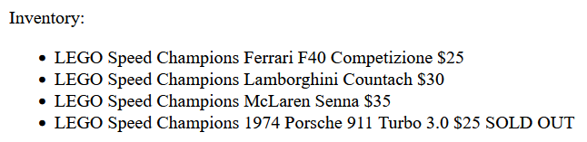
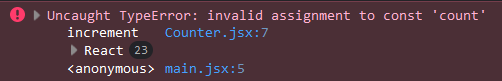
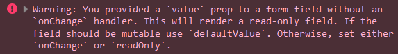
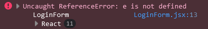
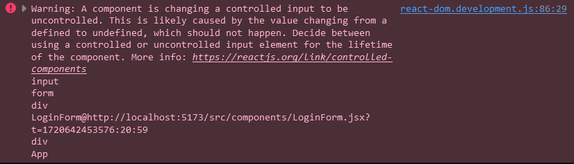
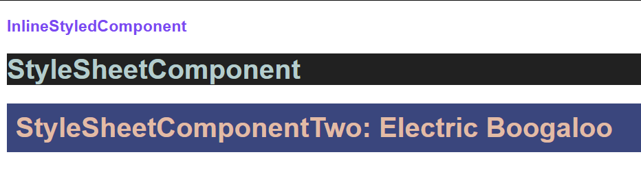

# React JS Notes

My adventures with React

## Table of contents:

1. [Component](#component)
   - [Writing custom function components](#writing-custom-function-components)
   - [Using components](#using-components)
   - [Using components inside components](#using-components-inside-components)
   - [Conditional Rendering](#conditional-rendering)
2. [JSX](#jsx)
3. [Props](#props)
   - [What is props?](#what-is-props)
   - [Basic usage of props](#basic-usage-of-props)
   - [Passing props](#passing-props)
   - [Using props with JS object capabilities](#using-props-with-js-object-capabilities)
   - [Sending arrays and objects as props](#sending-arrays-and-objects-as-props)
   - [Rendering arrays](#rendering-arrays)
   - [Rendering array of objects](#rendering-array-of-objects)
4. [Event Handling](#event-handling)
   - [Event Basics](#event-basics)
   - [Passing parameter to event](#passing-parameter-to-event)
5. [React Hooks](#react-hooks)
   - [What is a hook?](#what-is-a-hook)
   - [Hook Basics](#hook-basics)
   - [useState hook](#usestate-hook)
   - [useEffect hook](#useeffect-hook)
6. [State](#state)
   - [Why State?](#why-state)
   - [Using State](#using-state)
7. [Handling User Input](#handling-user-input)
   - [Handling Multiple Inputs](#handling-multiple-inputs)
   - [Handling Form Submission](#handling-form-submission)
8. [Styling](#styling)
   - [Inline Styling](#inline-styling)
   - [Styling with Global CSS](#styling-with-global-css)
   - [Styling with CSS Modules](#styling-with-css-modules)
   - [Styling with External CSS Libraries](#styling-with-external-css-libraries)
9. [React Technicals](#react-technicals)
10. [Vite Technicals](#vite-technicals)
11. [Nice to Have](#nice-to-have)

## Component

Reusable pieces of UI.

Reasons to use components:

1. **Modularity:** Breaking your project into small, manageable chunks makes it modular. Every module is (and should be) responsible for one task.

2. **Reusability:** Reusability is an extension of modularity. When needed, singly responsible component can be used in multiple places across the project.

3. **Testing:** If one component is not dependent on another component, it can be unit tested better than single complex structured component.

4. **Abstraction:** Hiding all the code and the complexion from where the component is called. Simply another file has the responsibility of implementing all the logic and markdown of a component. After that what's left is, just calling the component itself at where it should be used.

Common rules:

- Components can be written as a function or a class.
- A component has to return a [JSX](#jsx).

- In order for a component to be usable, it needs to be exposed.

### Writing custom function components

```jsx
function SomeComponent(){
  return(
    // ...
  );
}

export default SomeComponent;
```

- Or

  ```jsx
  export default function SomeComponent(){
    return(
      // ...
    );
  }
  ```

### Using components

- To be able to use exposed component, it needs to be imported like a module. After that, can be used like an HTML element.

  ```jsx
  // App.jsx
  import SomeComponent from "path/to/SomeComponent";

  function App() {
    return (
      <div className="App">
        <SomeComponent />
      </div>
    );
  }

  export default App;
  ```

### Using components inside components

Helps further encapsulaing thus making the code simpler to read and manage. Next example utilizes [Props](#props), checking that part out first highly recommended.

- As can be seen currently, Basket component has two functions: Iterating over a given list of items and listing individual items. Basket component does not need to know how list items being consumed. Breaking these two responsibilities and seperating each into on its own file is preferred.

```jsx
export default function Basket() {
  const basketItems = [
    { id: 1, name: "LEGO Speed Champions Ferrari F40 Competizione", price: 25 },
    { id: 2, name: "LEGO Speed Champions Lamborghini Countach", price: 30 },
    { id: 3, name: "LEGO Speed Champions McLaren Senna", price: 35 },
  ];

  return (
    <div>
      Basket:
      <ul>
        {basketItems.map((item) => (
          <li key={item.id}>
            {item.name} ${item.price}
          </li>
        ))}
      </ul>
    </div>
  );
}
```

- After seperating component to consume single list item:

```jsx
export default function BasketItem({ item }) {
  return (
    <li>
      {item.name} ${item.price}
    </li>
  );
}
```

- Notice that we offloaded the responsibility of handling the list item keys. According to React document, a component itself should know if it has a key. Because keys would not be passed as props. In order to use components requiring keys with map(), key should passed as another prop. **This is a common pitfall!** Therefore,

```jsx
import BasketItem from "./BasketItem";

export default function Basket() {
  const basketItems = [
    { id: 1, name: "LEGO Speed Champions Ferrari F40 Competizione", price: 25 },
    { id: 2, name: "LEGO Speed Champions Lamborghini Countach", price: 30 },
    { id: 3, name: "LEGO Speed Champions McLaren Senna", price: 35 },
  ];

  return (
    <div>
      Basket:
      <ul>
        {basketItems.map((item) => (
          <BasketItem key={item.id} item={item} />
        ))}
      </ul>
    </div>
  );
}
```

### Conditional Rendering

- Preference 1: Everything at one place all at once

```jsx
export default function LogInOutButton() {
  const isLoggedIn = false;

  if (isLoggedIn) {
    return (
      <div>
        <a href="#">Log Out</a>
      </div>
    );
  } else {
    return (
      <div>
        <a href="#">Log In</a>
      </div>
    );
  }
}
```

- Preference 2: Everything everywhere all at once

```jsx
// ButtonWithText.jsx
export default function ButtonWithText({ text }) {
  return (
    <div>
      <a href="#">{text}</a>
    </div>
  );
}

// LogInOutButton.jsx
import ButtonWithText from "./ButtonWithText";

export default function LogInOutButton() {
  const isLoggedIn = false;

  if (isLoggedIn) {
    return <ButtonWithText text="Log Out" />;
  } else {
    return <ButtonWithText text="Log In" />;
  }
}
```

- Preference 3: Element Variables

Because some people don't think having more than one return statement in a function is bad.

Element variables are, JS variables that can hold JSX elements.

```jsx
export default function LogInOutButton() {
  const isLoggedIn = false;

  // variable to hold conditionally rendering html
  let buttonElement;

  if (isLoggedIn) {
    buttonElement = (
      <div>
        <a href="#">Log Out</a>
      </div>
    );
  } else {
    buttonElement = (
      <div>
        <a href="#">Log In</a>
      </div>
    );
  }

  return buttonElement;
}
```

- Preference 4: Incorporating the ternary operator

If-else statemens can be written with ternary operator. But utilizing it is dependent on the JSX needs to be rendered. As can be seen in the next example, a simple statement like that can be hard to read. I strongly recommend using ternary operator with rendering components, not JSX itself for the sake of cleaner code.

```jsx
export default function LogInOutButton() {
  const isLoggedIn = false;

  return isLoggedIn ? (
    <div>
      <a href="#">Log Out</a>
    </div>
  ) : (
    <div>
      <a href="#">Log In</a>
    </div>
  );
}
```

=>

```jsx
import ButtonWithText from "./ButtonWithText";

export default function LogInOutButton() {
  const isLoggedIn = false;

  return isLoggedIn ? (
    <ButtonWithText text="Log Out" />
  ) : (
    <ButtonWithText text="Log In" />
  );
}
```

Is conditinal rendering only works on component scale? No. Let's say we have a shop and we want to show all our products but some of them are not in stock anymore.

```jsx
// ProductShowcase.jsx
export default function ProductShowcase({ product }) {
  return (
    <li>
      {product.name} ${product.price} {product.stock == 0 ? "SOLD OUT" : ""}
    </li>
  );
}

// Products.jsx
import ProductShowcase from "./ProductShowcase";

export default function Products() {
  const products = [
    {
      id: 1,
      name: "LEGO Speed Champions Ferrari F40 Competizione",
      price: 25,
      stock: 3,
    },
    {
      id: 2,
      name: "LEGO Speed Champions Lamborghini Countach",
      price: 30,
      stock: 15,
    },
    {
      id: 3,
      name: "LEGO Speed Champions McLaren Senna",
      price: 35,
      stock: 1,
    },
    {
      id: 4,
      name: "LEGO Speed Champions 1974 Porsche 911 Turbo 3.0",
      price: 25,
      stock: 0,
    },
  ];

  return (
    <div>
      Inventory:
      <ul>
        {products.map((product) => (
          <ProductShowcase key={product.id} product={product} />
        ))}
      </ul>
    </div>
  );
}
```



---

## JSX

Abbreviation of "JavaScript Extension". Looks like HTML DOM elements but in reality all of them are React JSX elements

- Every React component returns exactly one root element. Root can have multiple JSX elements and and these can have different attributes than standard HTML elements.

  ```jsx
  // This is valid:
  function SomeComponent() {
    return <h1>A Header</h1>;
  }
  ```

  ```jsx
  // This is not valid:
  function SomeComponent(){
    return <h1>A Header</h1> <p>Some paragraph</p>;
  }
  ```

  ```jsx
  // To return more than one element:
  function SomeComponent() {
    return (
      <div>
        <h1>A Header</h1>
        <p>Some paragraph</p>
      </div>
    );
  }
  ```

  - If you do not want the extra div, use shorthand _Fragment_ syntax. That way extra div would not be added to DOM tree.

    ```jsx
    function SomeComponent() {
      return (
        <>
          <h1>A Header</h1>
          <p>Some paragraph</p>
        </>
      );
    }
    ```

  - If you want to return more than one element but also parameterize them or pass a key (more on that on [Props](#props)), instead of using the shorthand you have to use Fragment itself.

    ```jsx
    import { Fragment } from "react";

    // ...

    const articleItems = articles.map((article) => (
      <Fragment key={article.id}>
        <h1>A Header</h1>
        <p>Some paragraph</p>
      </Fragment>
    ));

    // ...
    ```

- Allows us to evaluate JS in HTML.
- Evaluation should be used in curly braces and can be a variable, a function, a mathematical expression...

  ```jsx
  let name = "React";

  function Greet(){
    return "Hello!";
  }

  function SomeComponent(){
    return (
      <h1>{ Greet() }</h1>
      <p>I am learning { name }</p>
      <p>{9 + 10}</p>
    );
  }
  ```

---

## Props

### What is props?

Used to make the components dynamic. Currently all the components written is static. Performing the same action is might be preferable in some conditions but if that was the case, we had to write a different component for every action. That leads to code duplication and this behavior is against component structure. To achieve a dynamic stucture in React, parameterizing components is called "props".

### Basic usage of props

- Pass the "props" object as parameter to the function component just like vanilla JS.

- Objects cannot be rendered directly in components. Use object's respective keys to render in DOM.

```jsx
export default function SomeComponent(props) {
  return <h1>Hello {props.name}</h1>;
}
```

### Passing props

- Pass the value like an HTML attribute to the component where component is used.

```jsx
function App() {
  return <SomeComponent name="Bob" />;
}
```

- Or if you don't want to hardcode, use JSX evaluation syntax.

```jsx
function App() {
  const name = "Bob";
  return <SomeComponent name={name} />;
}
```

- Amount of props can be sent to the component has no limits.

### Using props with JS object capabilities

- JS destructor syntax can be used to destruct props object.

```jsx
export default function Hello(props) {
  const { message, name } = props;
  return (
    <h1>
      {message} {name}
    </h1>
  );
}
```

- Better than that, props can be destructed as soon as passed without extra step. Fun fact, you can send emojis as props.

```jsx
export default function Hello({ message, name }) {
  return (
    <h1>
      {message} {name}
    </h1>
  );
}
```

- **Props are immutable.** Which means, props' value cannot be changed after passing.

- With props; strings, other values, arrays, objects, functions and other components can be passed.

### Sending arrays and objects as props

is not different than using literals in JSX tags. Basically object inside of an object.

```jsx
// Player.jsx
export default function Player(props) {
  return (
    <div>
      <p>Nickname: {props.player.nickname}</p>
      <p>Level: {props.player.level}</p>
      <p>Class: {props.player.class}</p>
      <p>Active Effects: {props.player.activeEffects}</p>
    </div>
  );
}

// App.jsx
import Player from "./components/Player";

function App() {
  const player = {
    nickname: "Bob the Destructor",
    level: 38,
    class: "Dragonslayer",
    activeEffects: ["Strength II", "Healing I"],
  };

  return (
    <div className="App">
      <Player player={player} />
    </div>
  );
}

export default App;
```

- As can be seen if arrays passed and displayed directly, respective items will be concatenated then rendered.

  

### Rendering arrays

Can be achieved with JavaScript map() function.

**Note:** If after lambda _(=>)_ there is a method body _((x) => {//code to execute})_, it must have a return statement.

```jsx
export default function Player({ player }) {
  return (
    <div>
      <p>Nickname: {player.nickname}</p>
      <p>Level: {player.level}</p>
      <p>Class: {player.class}</p>
      <p>Active Effects:</p>
      <ul>
        {player.activeEffects.map((effect) => (
          <li>{effect}</li>
        ))}
      </ul>
    </div>
  );
}
```


- But after that an error can be seen in console about list item has no key attribute. This is a similar situation where Vue.js (<3) expects a key when looping a given array in order to render/apply animations etc. to virtual DOM elements.


- Assign a key to list item element so React can differentiate between them.
  - Keys have to be unique.
  - You CAN assign your keys random like from [UUID](https://www.npmjs.com/package/uuid).
  - You should NOT assign your keys with Math.random(). Or anything can cause clashing in that regard. Randomly generated numbers can clash and it is very slow for runtime in rendering. Random method will be executed every time a render occurs.
  - Your unique keys SHOULD be coming along with your dataset.
  - Do NOT use array index as key. Array can be manipulated and (eg. item removal) can result unexpected bugs.

```jsx
<li key={/* unique value goes here*/}> {/* item to render goes here*/} </li>
```

### Rendering array of objects

Not as straight forward as listing arrays with non object types. If object of an array being called to render by developer, React will throw an error indicating that objects are not a valid React child.

```jsx
export default function Basket() {
  const basketItems = [
    { id: 1, name: "LEGO Speed Champions Ferrari F40 Competizione", price: 25 },
    { id: 2, name: "LEGO Speed Champions Lamborghini Countach", price: 30 },
    { id: 3, name: "LEGO Speed Champions McLaren Senna", price: 35 },
  ];

  return (
    <div>
      <ul>
        {basketItems.map((item) => (
          <li key={item.id}>{item}</li>
        ))}
      </ul>
    </div>
  );
}
```


- With an error spaning the entire debug console, rendering objects might seem like a little daunting but the solution is simple. When we were not allowed to display props directly, we had to use `props.someProperty`. Just this time `object.someProperty`. Same should apply because both are objects.

```jsx
export default function Basket() {
  const basketItems = [
    { id: 1, name: "LEGO Speed Champions Ferrari F40 Competizione", price: 25 },
    { id: 2, name: "LEGO Speed Champions Lamborghini Countach", price: 30 },
    { id: 3, name: "LEGO Speed Champions McLaren Senna", price: 35 },
  ];

  return (
    <div>
      Basket:
      <ul>
        {basketItems.map((item) => (
          <li key={item.id}>
            {item.name} ${item.price}
          </li>
        ))}
      </ul>
    </div>
  );
}
```

---

## Event Handling

### Event Basics

To make a website interactive, JS events are used commonly. Like clicking a button or hovering a section. Every JS event has an implementation in React.

```jsx
<button onClick={someClickEventHandler}> Click </button>
```

is the React equivalent of this:

```html
<button onclick="someClickEventHandler()">Click</button>
```

- React events are written in _camelCase_.

<br>
Example below would simply give an alert to user.

```jsx
export default function BasicEventHandling() {
  function handleClick() {
    alert("You have been alerted!");
  }

  return <button onClick={handleClick}>click to get an alert</button>;
}
```

Notice that we haven't called the handler function using braces in JSX. If we did that, function would execute once (twice in strict mode) **[TODO: add reference]** upon rendering and not respond afterwards.

### Passing Parameter to Event

- When passing a parameter, braces are used same as non parameterized function. Thus executing function upon rendering because of function expression. As written above, calling a function directly in events would give an error.

- Lambda expressions can be used to negate this effect since it is a definition rather than an expression.

```jsx
export default function BasicEventHandling() {
  function handleClick(text) {
    alert(text);
  }

  return (
    <button onClick={() => handleClick("Custom text whooo!")}>
      click to get a customized alert
    </button>
  );
}
```

- JS event object can be catched like `(e) => myHandlerMethod(e)` if needed. For more examples see [Form Handling](#handling-user-input).

- Other parameters can be passed to handler function like `(e) => myHandlerMethod(e, param1, param2)`

---

## React Hooks

### What is a hook?

- [Hooks](https://react.dev/reference/react/hooks) are functions that allows developers to use special React features inside components. Like storing a value, sending data to deeply nested components, interacting with different systems (networking, APIs...), skipping render times. New hooks can be defined as well by combining built-in hooks [Reference](https://react.dev/learn/reusing-logic-with-custom-hooks#extracting-your-own-custom-hook-from-a-component).

### Hook Basics

- React hooks should only be called from React components.

- Built-in hooks: [useState](#state), [useEffect](#todo)

### useState hook

- For detailed information see [State](#state).

### useEffect hook

- Is used to synchronize a component with an external system. Like making API calls.

- useEffect hook expects a callback function called setup and an optional array of dependencies.

- Syntax:

```jsx
useEffect(() => {}, []);
```

- Setup will run when component is mounted at startup.

```jsx
useEffect(() => {
  console.log("Hello");
}, []);
```

- Above code will run once (twice if Strict Mode enabled) at page rendered for the first time.

```jsx
useEffect(() => {
  console.log("Hello");
}, [someTrackable]);
```

- Above code will execute every time `someTrackable` value changes.

- **How to decide if we need a dependency?** Dependencies are used inside setup function. If you want to reach a state or a prop from useEffect, add it as a dependency.

- Dependencies are called as "Reactive" values in React documents and can be state, prop, any value or function declared inside the component.

- Setup can include a cleanup function. Cleanup function executes before re-executing the entire effect when a change occured in dependencies. Cleanup happens with previous states or props even though it was updated. That way anything that needs to be closed (like a connection) or wiped away, can be executed last.

```jsx
useEffect(() => {
  console.log("Hello");
  return () => {
    // cleanup code
  };
}, [someTrackable]);
```

- Abobe code shows the syntax for one reactive value, a setup function and a cleanup function.

- Note: If you declared a function inside a setup and it is not working as expected, remember to call it afterwards.

```jsx
// will not work
useEffect(() => {
  function demo() {
    // some code
  }
}, []);

// will work
useEffect(() => {
  function test() {
    // some code
  }

  test();
}, []);
```

## State

### Why state?

[Props](#props) are immutable data containers in React. But what do we do when we need to store something mutable? That's where state comes in. States are objects that holding information about control or behavior of a component.

|         Prop          |           State           |
| :-------------------: | :-----------------------: |
| Passed to a component | Stored inside a component |
|       Immutable       |          Mutable          |
|   Like a parameter    |   Like a local variable   |

### Using state

- State can be used throughout app's life-cycle.
- Change of a state's value causes belonging component to re-render.
- States are changed with setter functions rather than reaching directly.
- States are defined using **useState()** React hook. To use, it should be imported.

```jsx
import { useState } from "react";
```

- After that syntax is simple. Make it const, define an array. First element of the array is the name of state, second element of the array is the setter of the state. Then initialize it with useState().

```jsx
const [count, setCount] = useState();
```

- State can be initialized at the time of definition. To initialize give a value to useState() like paramater.

```jsx
const [count, setCount] = useState(0);
```

- If we put together state with [event handlers](#event-handling) we can change value of a state and render it.

```jsx
import { useState } from "react";

export default function Counter() {
  const [count, setCount] = useState(0);

  function increment() {
    count += 1;
  }

  return (
    <div>
      <h1>Count: {count}</h1>
      <button onClick={increment}>Increment</button>
    </div>
  );
}
```

- But doing so will generate an error. Because value of a state cannot be accessed directly.



- Instead of accessing the value directly setter of state that we defined should be used. Setter function takes parameter as the new value of the state.

```jsx
import { useState } from "react";

export default function Counter() {
  const [count, setCount] = useState(0);

  function increment() {
    setCount(count + 1);
  }

  return (
    <div>
      <h1>Count: {count}</h1>
      <button onClick={increment}>Increment</button>
    </div>
  );
}
```

- Multiple states can exist in the same component.

```jsx
import { useState } from "react";

export default function Counter() {
  const [count, setCount] = useState(0);
  const [changeBy, setChangeBy] = useState(1);

  function increment() {
    setCount(count + changeBy);
  }

  function decrement() {
    setCount(count - changeBy);
  }

  function increaseChange() {
    setChangeBy(changeBy + 1);
  }

  function decreaseChange() {
    if (changeBy < 2) return;
    setChangeBy(changeBy - 1);
  }

  return (
    <div>
      <h1>Count: {count}</h1>
      <button onClick={increment}>Increment</button>
      <button onClick={decrement}>Decrement</button>

      <h2>Changing by value {changeBy} </h2>
      <button onClick={increaseChange}>Increase Change Speed</button>
      <button onClick={decreaseChange}>Decrease Change Speed</button>
    </div>
  );
}
```

## Handling User Input

- A text input without value attribute can be changed. But input with value attibute is rendered read-only. In order to be able to change the value of an input with value attribute, onChange handler should be attached.

```html
<input type="text" value="someText" />
```



- Similar to onClick method of a button, input field can be tracked with onChange event attribute. Execute every time input changes.

```jsx
export default function LoginForm() {
  function handleUsernameInput() {
    console.log("triggered...");
  }

  return (
    <div>
      <form>
        <input type="text" value="someText" onChange={handleInputUsername} />
      </form>
    </div>
  );
}
```

- Notice that, even if left blank, keyboard strokes would trigger the function but the text itself would not change. That is because value itself is hardcoded instead of assigning it to a value.

- A variable is needed that holds the information about the text of input. And it is none other than a [state](#state).

```jsx
import { useState } from "react";

export default function LoginForm() {
  const [username, setUsername] = useState("");

  function handleUsernameInput() {
    console.log("triggered...");
  }

  return (
    <div>
      <form>
        <input type="text" value={username} onChange={handleInputUsername} />
      </form>
    </div>
  );
}
```

- When a change occurs an event object is fired containing type of event, source, target, data etc. In order to be able to change the value of our state we can use input's onChange callback. But trying to catch the event directly in our onChange calback will yield an error.



- Instead directly catching the event with onChange callback method, we need to catch it with another method and return the event object.

- So in order to change a state with JSX input fields requires a structure as such:

  1. Catch event with a function in onChange accents event object
  2. Inside that function, return our handler method that modified to accept event object.
  3. In our handler method call setter of state.

- When logged to console, details of event object can be seen. But the part we are interested is the pressed key and it can be read as `e.target.value`.

```jsx
import { useState } from "react";

export default function LoginForm() {
  // initialize as blank
  const [username, setUsername] = useState("");

  // to oversee keyboard input
  function handleInputUsername(e) {
    setUsername(e.target.value);
  }

  return (
    <div>
      <form>
        <input
          type="text"
          value={username}
          onChange={function pokeball(e) {
            return handleInputUsername(e);
          }}
        />
      </form>
    </div>
  );
}
```

- A lambda function can be used to simplify the event object catching.

```jsx
import { useState } from "react";

export default function LoginForm() {
  const [username, setUsername] = useState("");

  function handleInputUsername(e) {
    setUsername(e.target.value);
  }

  return (
    <div>
      <form>
        <input
          type="text"
          value={username}
          onChange={(e) => handleInputUsername(e)}
        />
      </form>
    </div>
  );
}
```

- If no supervising (validation, type checking...) required, setter of state can be used instead of another function.

```jsx
import { useState } from "react";

export default function LoginForm() {
  const [username, setUsername] = useState("");

  return (
    <div>
      <form>
        <input
          type="text"
          value={username}
          onChange={(e) => setUsername(e.target.value)}
        />
      </form>
    </div>
  );
}
```

### Handling multiple inputs

- Two inputs can be managed like how one input is currently being managed. But what if we had n amount of inputs to manage? Are we gonna declare n amount of states? No. With one state managing an object with n properties is well suited for this job.

- Since state is now holding an object, setter is expecting an object to assign. That's why in setter we have passed an object with associated property.

```jsx
import { useState } from "react";

export default function LoginForm() {
  const [loginCredentials, setloginCredentials] = useState({
    username: "",
    password: "",
  });

  return (
    <div>
      <form>
        <input
          type="text"
          value={loginCredentials.username}
          onChange={(e) => setloginCredentials({ username: e.target.value })}
        />
        <input
          type="text"
          value={loginCredentials.password}
          onChange={(e) => setloginCredentials({ password: e.target.value })}
        />
      </form>
    </div>
  );
}
```

- But an error has raised. Simply saying that we are assigning `{username: "value"}` to `{username: "initialValue", password:"initialValue"}`.



- to fix it JS spread operator can be used. Spread operator states that: Get everything from that, and include this too. Since an object cannot have same propery again, passing a value with an existing property key is overriding previous.

```jsx
import { useState } from "react";

export default function LoginForm() {
  const [loginCredentials, setloginCredentials] = useState({
    username: "",
    password: "",
  });

  return (
    <div>
      <form>
        <input
          type="text"
          value={loginCredentials.username}
          onChange={(e) =>
            setloginCredentials({
              ...loginCredentials,
              username: e.target.value,
            })
          }
        />
        <input
          type="text"
          value={loginCredentials.password}
          onChange={(e) =>
            setloginCredentials({
              ...loginCredentials,
              password: e.target.value,
            })
          }
        />
      </form>
    </div>
  );
}
```

### Handling Form Submission

- In HTML after submitting the form, page refreshes or redirects to another URL. That is normal behavior. But in single page application perspective this action is suboptimal because refreshing the page causes data loss. States are cleared.

- To override this behavior, form submit button should call event object's `preventDefault()` method.

```jsx
import { useState } from "react";

export default function LoginForm() {
  const [loginCredentials, setloginCredentials] = useState({
    username: "",
    password: "",
  });

  function handleSubmit(e) {
    e.preventDefault();

    // save to db etc.
    console.log(loginCredentials);
  }

  return (
    <div>
      <form>
        <input
          type="text"
          value={loginCredentials.username}
          onChange={(e) =>
            setloginCredentials({
              ...loginCredentials,
              username: e.target.value,
            })
          }
        />
        <input
          type="text"
          value={loginCredentials.password}
          onChange={(e) =>
            setloginCredentials({
              ...loginCredentials,
              password: e.target.value,
            })
          }
        />

        <button onClick={(e) => handleSubmit(e)}>Login</button>
      </form>
    </div>
  );
}
```

## Styling

### Inline Styling

- Like HTML elements, JSX elements accept inline style tags.

- When writing autocomplete will generate the style attribute as such:

```jsx
export default function InlineStyledComponent() {
  return (
    <h3 style={}>InlineStyledComponent</h3>
  )
}
```

- We have used curly braces for evaluating JS. How are we gonna write CSS in JS area?

- While styling JSX, CSS is actually a JS object. React maps object propeties to CSS styles.

- If JSX styling done with objects, we require an object inside JS evaluator curly braces. Which happens to be curly braces inside curly braces. One for evaluation, one for defining CSS object.

```jsx
export default function InlineStyledComponent() {
  return <h3 style={{ color: "#7A49F1" }}>InlineStyledComponent</h3>;
}
```

- Writing regular styles would not work here because style is actually an object and object properties has to follow certain naming conventions. In CSS kebab-case is used to seperate words, here camelCase counterpart is used.

```jsx
// WRONG
export default function InlineStyledComponent() {
  return <h3 style={{ color: "#7A49F1", font-family:"Helvetica" }}>InlineStyledComponent</h3>;
}

// VALID
export default function InlineStyledComponent() {
  return <h3 style={{ color: "#7A49F1", fontFamily:"Helvetica" }}>InlineStyledComponent</h3>;
}
```


- Since style in JSX is an object, it can stored in a variable and used afterwards.

```jsx
export default function InlineStyledComponent() {
  const headerStyle = { color: "#7A49F1", fontFamily: "Helvetica" };

  return <h3 style={headerStyle}>InlineStyledComponent</h3>;
}
```

### Styling with Global CSS

- Write a style sheet and import. Just like HTML CSS selector styling.

- CSS files should be imported in the component will be used. To apply globally, should be imported in App.jsx.

```css
/* src/css/style.css */
.header {
  color: #f1497a;
  font-family: "Courier New", Courier, monospace;
  background-color: aliceblue;
}
```

```jsx
// src/components/StyleSheetComponent.jsx
import "../css/style.css";

export default function StyleSheetComponent() {
  return <h1 className="header">StyleSheetComponent</h1>;
}
```

### Styling with CSS Modules

- Instead of defining single stylesheet for the entire app, a stylesheet can be defined for every component. Reducing the chance of CSS name clashing.

- Useful when working at same project with large groups.

- Defined CSS file name should follow as `componentname.module.css`. Some developers prefer all lower case, some keeps component name same like, `ComponentName.module.css`. CSS selectors or classes are written as same.

- Importing should be done like so:

```jsx
import styles from "./ComponentName.module.css";
```

- And usage is similar to global styling. Only key difference is, since import statement is made via _styles_ and definition is part of JS, class names should be accessed as `classname={styles.className}` so React can evaluate JSX.

- As demonstrated with two different components, each having an element with same class name but different style.

  - **App.jsx**

  ```jsx
  import InlineStyledComponent from "./components/InlineStyledComponent";
  import StyleSheetComponent from "./components/StyleSheetComponent";
  import StyleSheetComponentTwo from "./components/StyleSheetComponentTwo";

  function App() {
    return (
      <div className="App">
        <InlineStyledComponent />
        <StyleSheetComponent />
        <StyleSheetComponentTwo />
      </div>
    );
  }

  export default App;
  ```

  - **StyleSheetComponent**

  ```css
  /* StyleSheetComponent.module.css */
  .header {
    background-color: rgb(33, 33, 33);
    color: rgb(180, 205, 205);
    font-family: Arial, Helvetica, sans-serif;
  }
  ```

  ```jsx
  /* StyleSheetComponent.jsx */
  import styles from "./StyleSheetComponent.module.css";

  export default function StyleSheetComponent() {
    return <h1 className={styles.header}>StyleSheetComponent</h1>;
  }
  ```

  - **StyleSheetComponentTwo**

  ```css
  /* StyleSheetComponentTwo.module.css */
  .header {
    background-color: rgb(58, 70, 125);
    color: rgb(227, 187, 165);
    font-family: Arial, Helvetica, sans-serif;
    padding: 10px;
  }
  ```

  ```jsx
  /* StyleSheetComponentTwo.jsx */
  import styles from "./StyleSheetComponentTwo.module.css";

  export default function StyleSheetComponentTwo() {
    return (
      <h1 className={styles.header}>
        StyleSheetComponentTwo: Electric Boogaloo
      </h1>
    );
  }
  ```

  

### Styling with external CSS Libraries

- [Bootstrap](https://getbootstrap.com/), [Tailwind](https://tailwindcss.com/)... Plug and play.

## React Technicals

- If we console.log() something it will be seen as two outputs because of dev environment. React.StrictMode executes what's encapsulating twice. It should be removed when project released to production.

```jsx
import React from "react";
import ReactDOM from "react-dom/client";
import App from "./App";

ReactDOM.createRoot(document.getElementById("root")).render(
  <React.StrictMode>
    <App />
  </React.StrictMode>
);
```

## Vite Technicals

- Hiding API keys with dotenv is different. [For more information](https://vitejs.dev/guide/env-and-mode.html).

- Instead of using `process.env.YOURKEYNAME`, use `import.meta.env.YOURKEYNAME`.

```js
const apiKey = import.meta.env.VITE_SOME_API_KEY;
```

- In .env file:

```
VITE_SOME_API_KEY = 'somaapikey'
```

- Environment variables without `VITE_` prefix will not be exposed to vite application. Will be seen as `undefined`. This prefix can be customized.

---

## Nice To Have

- In VS Code function components can be created with "rfc" shortcut. Similarly class components can be created with "rcc" shortcut. Pressing enter or tab will create the component with the same name of created file. There are bunch more auto-complete shortcuts like component with props, when using react native etc. Check out by writing rf (for function components) or rc (for class components) for listed Intellisense options.
