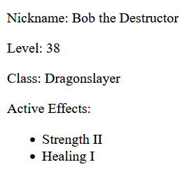

# React JS Notes

My adventures with React

## Keywords

### Component

Reusable pieces of UI.

Reasons to use components:

1. **Modularity:** Breaking your project into small, manageable chunks makes it modular. Every module is (and should be) responsible for one task.

2. **Reusability:** Reusability is an extension of modularity. When needed, singly responsible component can be used in multiple places across the project.

3. **Testing:** If one component is not dependent on another component, it can be unit tested better than single complex structured component.

4. **Abstraction:** Hiding all the code and the complexion from where the component is called. Simply another file has the responsibility of implementing all the logic and markdown of a component. After that what's left is, just calling the component itself at where it should be used.

Common rules:

- Components can be written as a function or a class.
- A component has to return a [JSX](#jsx).

- In order for a component to be usable, it needs to be exposed.

  ```jsx
  function SomeComponent(){
    return(
      // ...
    );
  }

  export default SomeComponent;
  ```

  - Or

    ```jsx
    export default function SomeComponent(){
      return(
        // ...
      );
    }
    ```

- To be able to use exposed component, it needs to be imported like a module. After that, can be used like a HTML element.

  ```jsx
  // App.jsx
  import SomeComponent from "path/to/SomeComponent";

  function App() {
    return (
      <div className="App">
        <SomeComponent />
      </div>
    );
  }

  export default App;
  ```

---

### JSX

Abbreviation of "JavaScript Extension". Looks like HTML DOM elements but in reality all of them React JSX elements

- Every React component returns exactly one root element. Root can have multiple JSX elements and and these can have different attributes than standard HTML elements.

  ```jsx
  // This is valid:
  function SomeComponent() {
    return <h1>A Header</h1>;
  }
  ```

  ```jsx
  // This is not valid:
  function SomeComponent(){
    return <h1>A Header</h1> <p>Some paragraph</p>;
  }
  ```

  ```jsx
  // To return more than one element:
  function SomeComponent() {
    return (
      <div>
        <h1>A Header</h1>
        <p>Some paragraph</p>
      </div>
    );
  }
  ```

  - If you do not want the extra div, use shard syntax. That way extra div would not be added to DOM tree.

    ```jsx
    function SomeComponent() {
      return (
        <>
          <h1>A Header</h1>
          <p>Some paragraph</p>
        </>
      );
    }
    ```

- Allows us to evaluate JS in HTML.
- Evaluation should be used in curly braces and can be a variable, a function, a mathematical expression...

  ```jsx
  let name = "React";

  function Greet(){
    return "Hello!";
  }

  function SomeComponent(){
    return (
      <h1>{ Greet() }</h1>
      <p>I am learning { name }</p>
      <p>{9 + 10}</p>
    );
  }
  ```

---

### Props

To make the components dynamic. Currently all the components written is static. Performing the same action is might be preferable in some conditions but if that was the case, we had to write a different component for every action. That leads to code duplication and this behavior is against component structure. To achieve a dynamic stucture in React, parameterizing components is called "props".

- Pass the "props" object as parameter to the function component just like vanilla JS.

- Objects can not be rendered directly in components. Use object's respective keys to render in DOM.

```jsx
export default function SomeComponent(props) {
  return <h1>Hello {props.name}</h1>;
}
```

- Pass the value like an HTML attribute to the component where component is used.

```jsx
function App() {
  return <SomeComponent name="Bob" />;
}
```

- Or if you don't want to hardcode, use JSX evaluation syntax.

```jsx
function App() {
  const name = "Bob";
  return <SomeComponent name={name} />;
}
```

- Amount of props can be sent to the component has no limits.

- JS destructor syntax can be used to destruct props object.

```jsx
export default function Hello(props) {
  const { message, name } = props;
  return (
    <h1>
      {message} {name}
    </h1>
  );
}
```

- Better than that, props can be destructed as soon as passed without extra step. Fun fact, you can send emojis as props.

```jsx
export default function Hello({ message, name }) {
  return (
    <h1>
      {message} {name}
    </h1>
  );
}
```

- **Props are immutable.** Which means, its value can not be changed after passing.

- With props; strings, other values, arrays, objects, functions and other components can be passed.

- **Sending arrays and objects as props** is not different than using literals in JSX tags.

```jsx
// Player.jsx
export default function Player(props) {
  return (
    <div>
      <p>Nickname: {props.player.nickname}</p>
      <p>Level: {props.player.level}</p>
      <p>Class: {props.player.class}</p>
      <p>Active Effects: {props.player.activeEffects}</p>
    </div>
  );
}

// App.jsx
import Player from "./components/Player";

function App() {
  const player = {
    nickname: "Bob the Destructor",
    level: 38,
    class: "Dragonslayer",
    activeEffects: ["Strength II", "Healing I"],
  };

  return (
    <div className="App">
      <Player player={player} />
    </div>
  );
}

export default App;
```

- As can be seen if arrays passed and displayed directly, respective items will be concatenated then rendered.

  

- **Rendering arrays** can be achieved with JavaScript map() function.

```jsx
export default function Player({ player }) {
  return (
    <div>
      <p>Nickname: {player.nickname}</p>
      <p>Level: {player.level}</p>
      <p>Class: {player.class}</p>
      <p>Active Effects:</p>
      <ul>
        {player.activeEffects.map((effect) => (
          <li>{effect}</li>
        ))}
      </ul>
    </div>
  );
}
```



- But after that an error can be seen in console about list item has no key attribute. This is a similar situation where Vue.js (<3) requires a key when looping a given array in order to render/apply animations etc. to virtual DOM elements.


- Assign a key to list item element so React can differentiate between them.
  - Keys have to be unique.
  - You CAN assign your keys random like from [UUID](https://www.npmjs.com/package/uuid).
  - You should NOT assign your keys with Math.random(). Or anything can cause clashing in that regard. Randomly generated numbers can clash and it is very slow for runtime in rendering. Random method will be executed every time a render occurs.
  - Your unique keys SHOULD be coming along with your dataset.
  - Do NOT use array index as key. Array can be manipulated and (eg. item removal) can result unexpected bugs.

```jsx
<li key={/* key goes here*/}> {/* item to render goes here*/} </li>
```

- **Rendering array of objects** is not as straight forward as listing arrays with non object types. If object of an array being called to render by developer, React will throw an error indicating that objects are not a valid React child.

```jsx
export default function Basket() {
  const basketItems = [
    { id: 1, name: "LEGO Speed Champions Ferrari F40 Competizione", price: 25 },
    { id: 2, name: "LEGO Speed Champions Lamborghini Countach", price: 30 },
    { id: 3, name: "LEGO Speed Champions McLaren Senna", price: 35 },
  ];

  return (
    <div>
      <ul>
        {basketItems.map((item) => (
          <li key={item.id}>{item}</li>
        ))}
      </ul>
    </div>
  );
}
```


- With an error spaning entirety of the debug console rendering objects might seem like a little daunting but the solution is simple. Objects can not be rendered directly but their values can.

```jsx
export default function Basket() {
  const basketItems = [
    { id: 1, name: "LEGO Speed Champions Ferrari F40 Competizione", price: 25 },
    { id: 2, name: "LEGO Speed Champions Lamborghini Countach", price: 30 },
    { id: 3, name: "LEGO Speed Champions McLaren Senna", price: 35 },
  ];

  return (
    <div>
      Basket:
      <ul>
        {basketItems.map((item) => (
          <li key={item.id}>
            {item.name} ${item.price}
          </li>
        ))}
      </ul>
    </div>
  );
}
```

---

### React Technicals

- If we console.log() something it will be seen as two outputs because of dev environment. React.StrictMode executes what's encapsulating twice. It should be removed when project released to production.

```jsx
import React from "react";
import ReactDOM from "react-dom/client";
import App from "./App";

ReactDOM.createRoot(document.getElementById("root")).render(
  <React.StrictMode>
    <App />
  </React.StrictMode>
);
```

---

### Nice To Have

- In VS Code function components can be created with "rfc" shortcut. Similarly class components can be created with "rcc" shortcut. Pressing enter or tab will create the component with the same name of created file. There are bunch more auto-complete shortcuts like component with props, when using react native etc. Check out by writing rf (for function components) or rc (for class components) and check out listed Intellisense.
